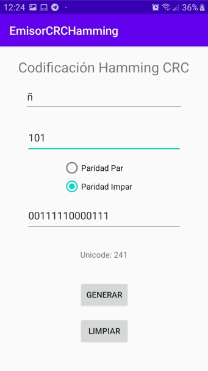

# EmisorCRCHamming
This project simulates the process of the  transmitter a byte of information into a network. It creates the hamming code with the byte to send after that apply the CRC and finally it shows the  bit stream to be sent.

## 1. Examples
### 1.   even parity (paridad par)

### 2.   odd parity (paridad impar)

